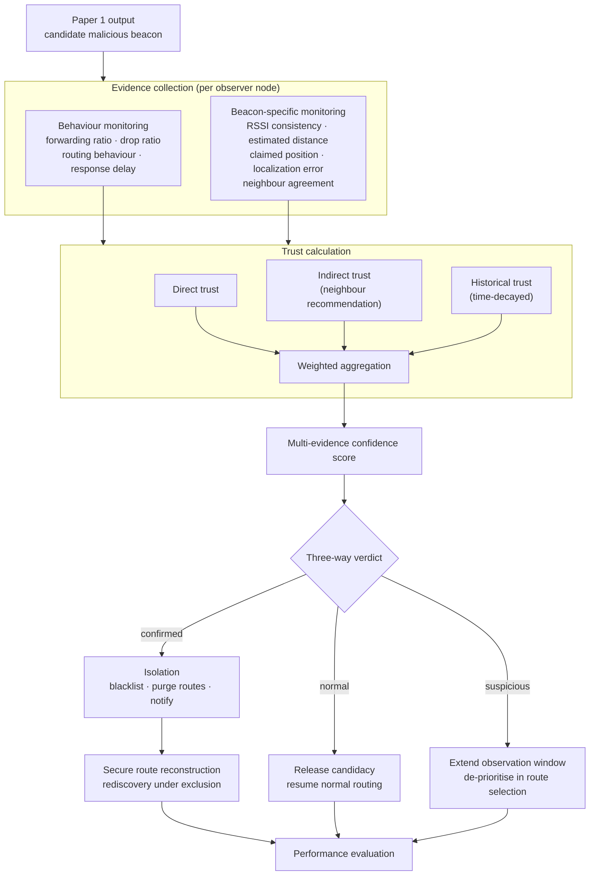

# Step 3 — Architecture

## Pipeline

## Layer responsibilities

**Evidence collection** is per-observer and local. Every node maintains an evidence
record for each beacon it can hear. Nothing is centralised — a central observer would
be an unrealistic MANET assumption and would invalidate the overhead measurements.

**Trust calculation** combines the observer's own evidence (direct), what neighbours
report (indirect) and what the observer previously believed (historical). Indirect
trust is where the overhead lives, and where a compromised recommender could attack
the scheme; that exposure is noted now and bounded in Step 8.

**Verdict** is deliberately three-way rather than a single threshold. See Step 9.

**Isolation and recovery** are one unit, not two. Isolation without recovery leaves
the network worse off than before — routes are broken and nothing replaces them.
Objective 4 is only satisfied when both halves are measured together.

## Feature inventory

These are the columns the simulator must produce. Everything downstream is derived
from this list, so it is fixed here before any code is written.

### Behavioural (per observed node, per observation window)

| Symbol | Feature | Definition |
|---|---|---|
| `F_i` | Forwarding ratio | packets forwarded / packets received for forwarding |
| `D_i` | Drop ratio | packets dropped / packets received for forwarding |
| `d_i` | Forwarding delay | mean relay latency, receive → transmit |
| `c_i` | Control consistency | RREP claims vs. observed forwarding |
| `x_i` | Retransmission rate | MAC-layer retries |
| `r_i` | Route participation | fraction of active routes including the node |

Note `F_i + D_i ≠ 1` in general — packets can also be lost to collision or buffer
overflow rather than deliberately dropped. Treating them as complements would bake a
false assumption into the trust model.

### Localization (per observed beacon, per observer)

| Symbol | Feature | Definition |
|---|---|---|
| `ρ_ij` | RSSI | received signal strength, observer *j* from beacon *i* |
| `d̂_ij` | Estimated distance | RSSI inverted through the path-loss model |
| `d̃_ij` | Claimed distance | ‖claimed position of *i* − position of *j*‖ |
| `ε_ij` | Localization residual | `\|d̂_ij − d̃_ij\|` |
| `σ_i` | RSSI deviation | variance of `ε_ij` over the window |
| `A_i` | Neighbour agreement | fraction of observers whose residual also exceeds tolerance |

`ε_ij` is the core quantity. An honest beacon has a residual bounded by path-loss
estimation noise; a false-location beacon has a residual that tracks its lie.

### Ground truth (never an input to the model)

`true position`, `attack_type`, `attack window`, `actual drop count`.

## Observation window

Sliding, 10 s, 50 % overlap. Short enough that mobility does not invalidate the
neighbour set, long enough that a 4 pkt/s CBR flow contributes enough samples for the
ratios to mean anything. Window length is a sensitivity parameter in Step 12 —
it trades detection latency against false-positive rate, and that trade-off is a
result worth plotting.

## What this architecture commits us to

1. Observers must be able to compute `ε_ij`, so the simulator must expose per-packet
   RSSI at the point of reception. This drives the NS-3 design in Step 4.
2. Behavioural and localization evidence must remain separable all the way to the
   fusion step, so that the Step 12 ablation can switch either branch off.
3. Isolation must be reversible, because a `suspicious` verdict can be revised.
   Blacklists are therefore soft state with expiry, not permanent.
